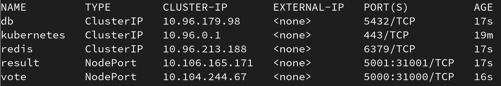
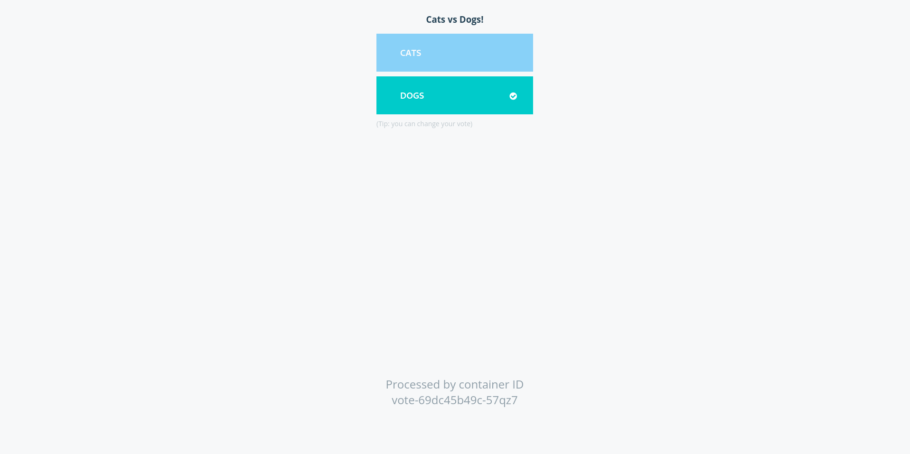

# Primer Entrega

Despligue de la aplicación en Minikube.

## Requisitos

Los siguientes pasos están especificados para GNU/Linux, requiriéndose de los siguientes paquetes:

- [`minikube`](https://minikube.sigs.k8s.io/docs/start/)


## Pasos

### Inicializar Clúster

Debemos inicializar el clúster con el driver de `docker`:
```bash
minikube start --driver=docker
alias kubectl="minikube kubectl --"
kubectl get pods -A
```

### Ejecutar aplicación en Kubenetes

Asumiendo que se está en la carpeta [primer-entrega](/primer-entrega/), debemos correr la aplicación en Kubernetes:

```bash
kubectl create -f k8s-specifications/
```

Para comprobar que todo se creó correctamente, verificamos los servicios:

```bash
kubectl get services
```

Donde se deberían observar los servicios `db`, `redis`, `result` y `vote`:



### Visualizar servicios Frontend

Finalmente, podremos interactuar con el frontend obteniendo su URL:

```bash
minikube service vote --url
```

Al ingresar a este, observaremos:



### Limpieza de residuales

Una vez nos hayamos asegurado de que todo está bien, podremos detener `minikube`, no sin antes eliminar los residuales. Para ello, escribimos:

```bash
kubectl delete -f k8s-specifications/
minikube stop
```