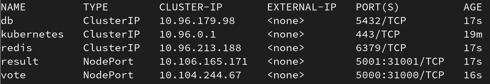
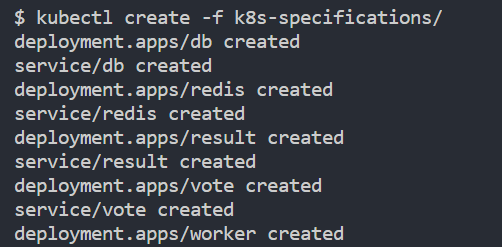
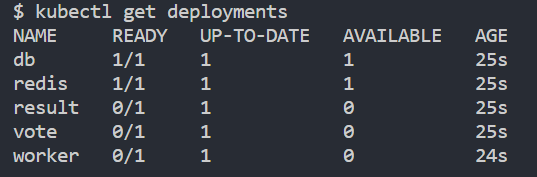
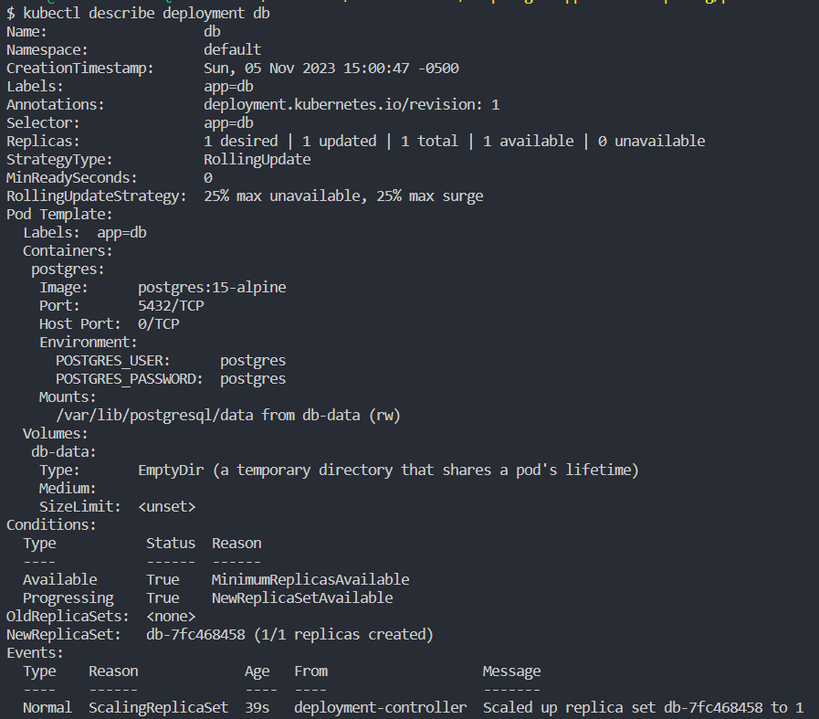
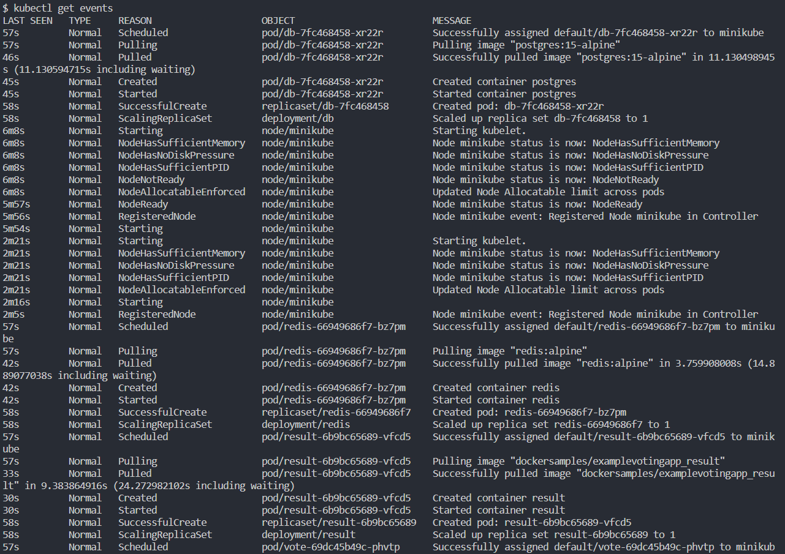
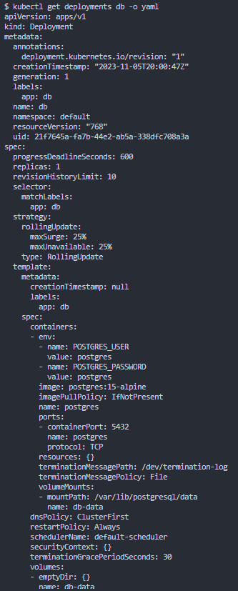
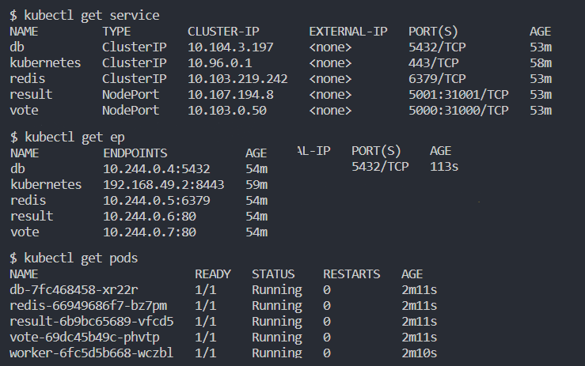
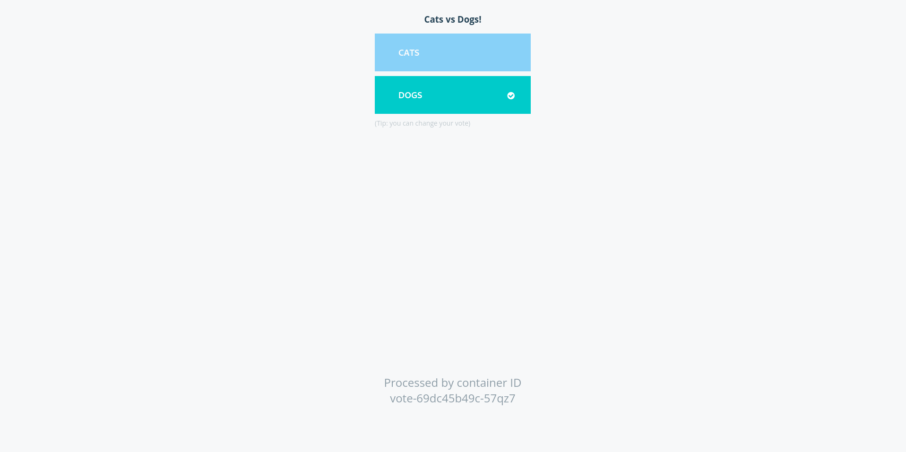

# Primer Entrega

Despligue de la aplicación en el minikube.

## Requisitos

Los siguientes pasos están especificados para GNU/Linux, requiriéndose de los siguientes paquetes:

- [`minikube`](https://minikube.sigs.k8s.io/docs/start/)
- [`docker`](https://docs.docker.com/engine/install/)

## Pasos

### Inicializar Clúster

Debemos inicializar el clúster Minikube con el driver de `docker` y 
asegurarse de que kubectl esté configurado para apuntar al clúster de Minikube. 

```bash
minikube start --driver=docker
alias kubectl="minikube kubectl --"
kubectl get pods -A
```

### Ejecutar aplicación en Kubenetes

Asumiendo que se está en la carpeta [primer-entrega](/primer-entrega/), debemos correr la aplicación en Kubernetes:

```bash
kubectl create -f k8s-specifications/
```

Para comprobar que todo se creó correctamente, verificamos los servicios:

```bash
kubectl get services
```

Donde se deberían observar los servicios `db`, `redis`, `result` y `vote`:



La alternativa para esto es clonar directamente el repositorio github de la aplicación

```bash
git clone https://github.com/dockersamples/example-voting-app
cd example-voting-app
```

Y después. crear los recursos en el clúster de Minikube utilizando el comando `kubectl create`.

```bash
kubectl create -f k8s-specifications/
```

Esto deberá retornar un output como el mostrado en la imagen. Se puede observar el proceso para desplegar varias aplicaciones en un clúster de Kubernetes. Como resultado, se crearon múltiples recursos, incluyendo despliegues y servicios, para las aplicaciones correspondientes. Estos recursos permitirán que las aplicaciones se ejecuten y estén disponibles dentro del clúster, lo que facilita la administración y escalabilidad de las mismas.



### Información que se puede obtener del despliegue

Se puede obsevar el despliegue realizado con el comando:

```bash
kubectl get deployments
```

Que dara el output mostrado en la imagen. El resultado muestra una lista de los despliegues existentes, junto con detalles sobre su estado actual. Particularmente, se muestran los despliegues de las aplicaciones con sus respectivos nombres, el número de réplicas deseadas frente al número de réplicas disponibles, y la antigüedad de cada despliegue.



Además, se puede ver en detalle los detalles de cada uno de los despliegues.

```bash
kubectl describe deployment db
```

Como se puede ver en la imagen, se proporciona detalles específicos sobre el despliegue de `db`. Particularmente, se muestra el nombre, namespace, fecha de creación, etiquetas, estrategia de actualización del tipo "RollingUpdate", una replica, la plantilla de pod, volumen, condiciones y eventos.



También se pueden ver el registro de eventos de nuestro despliegue.

```bash
kubectl get events
```

Como se ve en la imagen, se muestra una lista de eventos ocurridos en el clúster de Kubernetes. Estos eventos proporcionan información sobre las actividades y cambios en el clúster. Este es el resumen de algunos de los eventos registrados:

1. Se programó el pod "db-7fc468458-xr22r" con éxito y se asignó a un nodo llamado "minikube".
2. El pod "db-7fc468458-xr22r" comenzó a descargar la imagen "postgres:15-alpine".
3. La imagen "postgres:15-alpine" se descargó con éxito.
4. Se creó el contenedor "postgres" dentro del pod "db-7fc468458-xr22r".
5. El contenedor "postgres" se inició con éxito.
6. Se creó un ReplicaSet para el despliegue "db" y se creó el pod "db-7fc468458-xr22r".
7. Se escaló el ReplicaSet del despliegue "db" a 1 réplica disponible.



Además, se puede visualizar los elementos existentes en el clúster en una salida YAML utilizable, para ver la estructura de cómo está desplegado actualmente.

```bash
kubectl get deployments db -o yaml
```

Se puede visualizar

- `apiVersion` y `kind`: Indican que se trata de un recurso de tipo "Deployment" en la versión "apps/v1".
- `metadata`: Contiene metadatos sobre el despliegue, como etiquetas, nombre, namespace, etc.
- `spec`: Define las especificaciones del despliegue, incluyendo el número deseado de réplicas (1), estrategia de actualización, plantilla de pod, contenedor, puertos, variables de entorno, y volúmenes.
- `status`: Muestra información sobre el estado actual del despliegue, como el número de réplicas disponibles (1), condiciones (disponibilidad y progreso), la generación observada y el número de réplicas actualizadas.




Finalmente, se puede visualizar información adicional de la siguiente forma:

```bash
kubectl get service
kubectl get ep
kubectl get pods
```

Como se ve en la imagen, se muestra información sobre los diferentes servicios. El comando `kubectl get service db` muestra información sobre: name, type, cluster-ip, external-ip, ports y age. El comando `kubectl get ep` muestra información sobre los puntos finales (endpoints) asociados a los servicios. El comando `kubectl get pods` muestra una lista de los pods en el clúster de Kubernetes junto con información relevante sobre su estado. Particularmente, se muestra: name, ready, status, restarts y age.



### Visualizar servicios Frontend

Finalmente, podremos interactuar con el frontend obteniendo su URL:

```bash
minikube service vote --url
```

Al ingresar a este, observaremos:



### Limpieza de residuales

Una vez nos hayamos asegurado de que todo está bien, podremos detener `minikube`, no sin antes eliminar los residuales. Para ello, escribimos:

```bash
kubectl delete -f k8s-specifications/
minikube stop
```