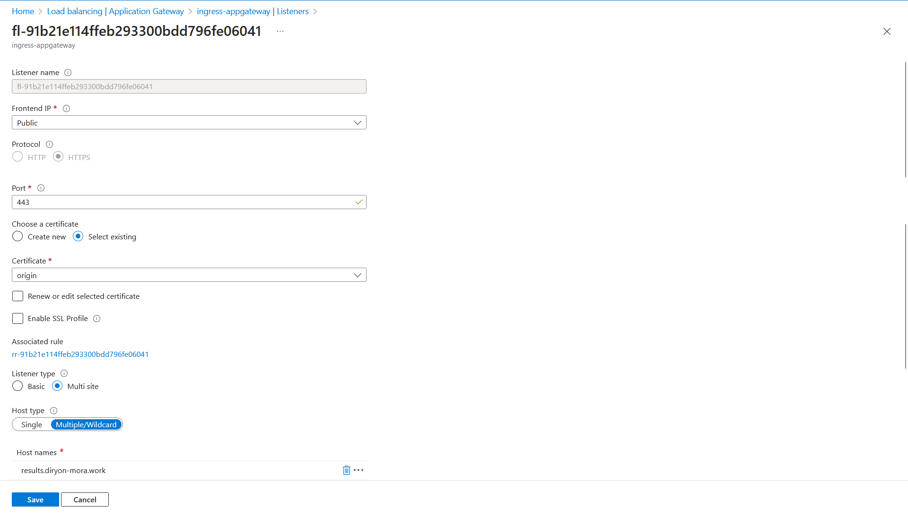
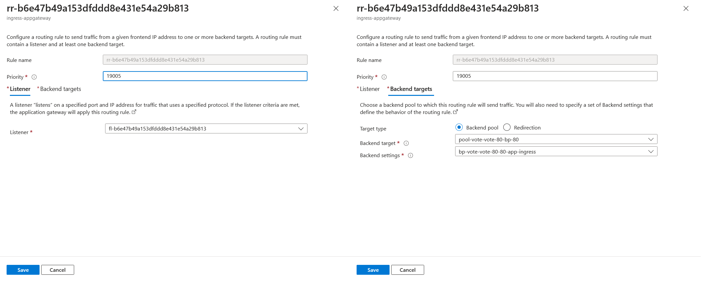
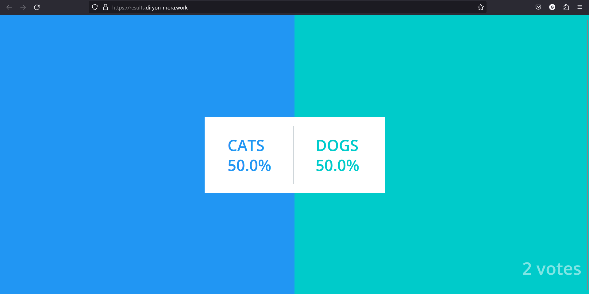

# Segunda Entrega

Este documento detalla los pasos de implementación del WAF/Frontdoor/app-gateway.

## Pasos

### Crear el Resource Group

Primero que nada, se debe establecer un Resource Group donde se realizará todo el trabajo, este paso es el más sencillo, pues solo se debe asisgnar un nombre, en nuestro caso, se utilizó `MC_cloud-computing_clu-vote_eastus`. Vease la siguiente imagen como referencia.

Luego se debe establecer un Grupo de Recursos donde se llevará a cabo todo el trabajo. Este grupo proporciona un entorno organizado para administrar y agrupar recursos relacionados, lo que facilita la gestión y el mantenimiento durante el desarrollo del proyecto.

Esta fase es bastante sencilla, ya que solo implica asignar un nombre. En nuestro caso, se utilizó el nombre `MC_cloud-computing_clu-vote_eastus`. Puedes ver la imagen a continuación como referencia.


### Crear la Virtual Network

Para configurar el Application Gateway, es necesario emplear una Virtual Network. El primer paso es nombrar esta red, en este caso, se la denominó `AKS-vnet-16379065`, como se muestra en la imagen a continuación: 


Posteriormente, se debe definir el `Address space` para este proyecto. En este escenario específico, se optó por `10.224.0.0/12`, aunque es fundamental disponer de un espacio lo suficientemente amplio para futuras expansiones. Además, se deben crear dos subredes. La primera, `aks-subnet`, se configuró como `10.224.0.0/24`. La segunda, llamada `ingress-appgateway-subnet`, se definió como `10.225.0.0/24`. Se recomienda que estas subredes finalicen en `/24` para limitar a 255 direcciones, evitando un exceso de direcciones no utilizadas. Véase las siguientes imagenes como referencia:


### Crear y configurar el Kubernet

El siguiente paso es la creación y configuración del clúster de Kubernetes en el que trabajaremos. Esta tarea es sencilla, solo se debe asignar un nombre al clúster, en este caso, se le llamó `Clue-vote`, y agregarlo al mismo Grupo de Recursos creado anteriormente, como se muestra en la imagen a continuación:


Posteriormente, siguiendo los pasos de la entrega anterior, se inicia la configuración del clúster a través de la terminal de Azure. Los resultados de esta acción se pueden apreciar en la siguiente imagen:


Para exponer la dirección IP pública de la aplicación frontend, se deben realizar los siguientes cambios en el archivo [./k8s-specifications/vote-service.yaml](/segunda-entrega/k8s-specifications/vote-service.yaml) y en el archivo [./k8s-specifications/result-service.yaml](/segunda-entrega/k8s-specifications/result-service.yaml):

- Modificar el `type` a `LoadBalancer`.
- Establecer el `port` en `80`.
- Eliminar el `targetPort`.

La imagen a continuación sirve como referencia para estos cambios. 


Es importante mencionar que estos pasos se deben realizar si se esta partiendo de la primera entrega, siendo necesario el redeploy de la aplicación.

```bash
# Para actualizar si ya esta creado
kubectl apply -f /k8s-specifications 
```

Si se parte desde la segunda entrega, con los nuevos archivos de la carpeta [./k8s-specifications/](/segunda-entrega/k8s-specifications/), se siguen los siguientes comandos:

```bash
namespace="vote"
kubectl delete namespace --ignore-not-found=true -n $namespace
kubectl create namespace $namespace
kubectl apply -f k8s-specifications / -n $namespace
```

Estos cambios permiten obtener la dirección IP pública, como se muestra en la siguiente imagen:


La aplicación resultante puede ser visualizada a través de un navegador:


### Configuración de la Política para el Web Application Firewall

Para el correcto funcionamiento del WAF en el Application Gateway, es necesario crear una política específica. En primer lugar, se asigna un nombre a esta política, en este caso, se utilizó el nombre `ag-aks`, y se configura en modo de detección. Luego, se debe asociar esta política a todos los recursos previamente establecidos. Puedes observar la imagen a continuación como referencia:


Posteriormente, se procede a seleccionar las Managed Rules conforme a los diferentes niveles de seguridad requeridos. En este proyecto, que se considera relativamente sencillo y con bajos riesgos, se optó por el conjunto de reglas OWASP 3.0. No obstante, se recomienda encarecidamente revisar y ajustar estas reglas según la complejidad y los riesgos particulares de cada proyecto. La imagen a continuación muestra la configuración de las reglas:


### Creación del Application Gateway

El próximo paso es la creación del Application Gateway. En primer lugar, se le asigna un nombre, en este caso, se ha elegido `ingress-appgateway`. Se configura como WAF_V2 utilizando las políticas creadas anteriormente. Además, se le asigna la Virtual Network y una de las subredes, como se puede apreciar en la imagen a continuación:


Luego, se procede con la configuración de los frontends. Se elige una nueva IP que servirá como el punto de conexión para todos los microservicios. Esta IP se denomina `ingress-appgateway`, como se muestra en la siguiente imagen:


A continuación, se configuran los backends. Se asocian las direcciones IP públicas generadas anteriormente con un nombre específico. Por ejemplo, `pool-vote-result-80-bp-80` está asociada a `20.118.147.192` y `pool-vote-vote-80-bp-80` a `20.118.147.240`, como se evidencia en la imagen:


Finalmente, se lleva a cabo la configuración de la tabla de enrutamiento para dirigir las direcciones públicas a un solo destino. Sin embargo, surge un problema debido a que ambas aplicaciones utilizan el puerto 80, lo que imposibilita añadir más de una regla de enrutamiento con el mismo puerto. En este caso, se optó por utilizar un sitio externo como intermediario en esta etapa.

Se procede a crear un Listener TLS certificate correspondiente al dominio utilizado, `diryon-mora.work`. Este certificado se genera en Cloudflare (mi hosting) con formato `.pem` y una clave privada, posteriormente se pasa al OpenSSL para generar un archivo `.pfx` junto con una contraseña.

Finalmente, se configuran los siguientes Listeners:




Se establecen los siguientes Backend settings:


Y se definen las reglas de enrutamiento:





## Visualizacion Finales

Ya con la correcta configuración del Application Gateway para dirigir el tráfico entrante hacia los destinos apropiados, se puede acceder a las aplicaciones desde los sitios:

Para la aplicación de voto [https://vote.diryon-mora.work/](https://vote.diryon-mora.work/), lo que nos muestra:


Para la aplicación de resultados [https://results.diryon-mora.work/](https://results.diryon-mora.work/)




## Comentarios Finales

1. **Implementación Exitosa del Application Gateway:** La configuración detallada del Application Gateway ha permitido dirigir el tráfico entrante hacia las aplicaciones desplegadas, asegurando así su accesibilidad desde direcciones web específicas.

2. **Uso Efectivo del Web Application Firewall (WAF):** La aplicación de políticas WAF_V2 y la selección de reglas de seguridad, como OWASP 3.0, han reforzado la seguridad de las aplicaciones, protegiéndolas contra posibles amenazas y vulnerabilidades.

3. **Integración Completa con la Red y Subredes:** La vinculación del Application Gateway con la Virtual Network y subredes específicas ha garantizado una estructura de red eficiente y organizada para la gestión y seguridad de las aplicaciones desplegadas.

4. **Necesidad de Consideraciones en la Configuración de Puertos:** La limitación en la configuración de reglas de enrutamiento debido al uso del mismo puerto por ambas aplicaciones demuestra la importancia de considerar los aspectos de configuración y la disponibilidad de puertos al diseñar la arquitectura.

5. **Acceso Público y Usabilidad:** Las aplicaciones ahora son fácilmente accesibles a través de enlaces web específicos, lo que mejora la usabilidad y permite a los usuarios interactuar con las aplicaciones desplegadas de manera sencilla.
