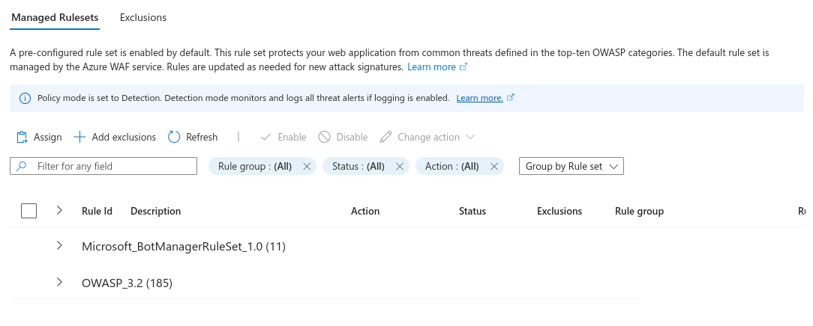
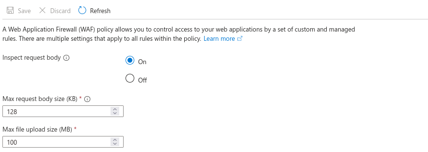
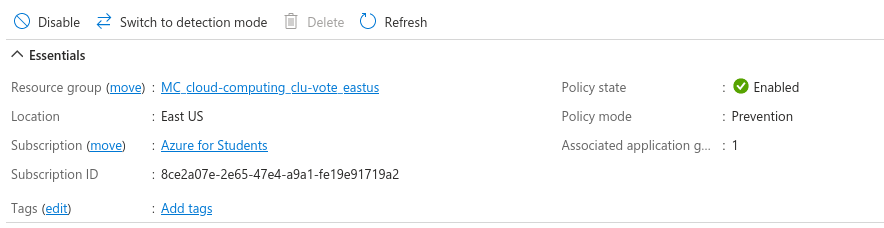

# Tercera Entrega

Se incluirá la aplicación desplegada en Azure, dentro de un AKS y asegurada mediante WAF, junto a una explicación de cómo opera.

## Configuración WAF

Inicialmente, tenemos un conjunto de reglas por default. Por un lado, están las definidas por OWASP (CRS), el cual son un gran conjunto de reglas de detección que suelen proteger un sitio web de diversos ataques, entre los que se incluyen inyección SQL o cross-site scripting.

Por otro lado, también se habilitaron reglas pre-establecidas por Microsoft en contra de ataque de bots maliciosos.

Asímismo, se han configurado restricciones al body de las requests, que en nuestra aplicación es innecesario, pero en general es una buena práctica:

Finalmente desplegamos el WAF, cambiando su modo de política a **Prevención**.

## ¿Cómo opera la aplicación?

Cuando un usuario ingresa a alguno de los dos dominios, el tráfico pasa por el Application Gateway (AG), actuándo como balanceador de carga y un WAF. El AG verifica las cabeceras y el cuerpo de la solicitud, si está presente, contra las reglas de WAF configuradas. Si la solicitud es valida, el AG enruta al backend adecuado según la configuración del `ingress.yml`, que en este caso es el puerto 80, eligiendo el backend según el dominio.